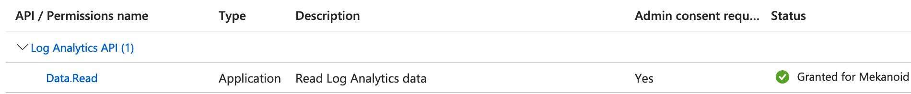
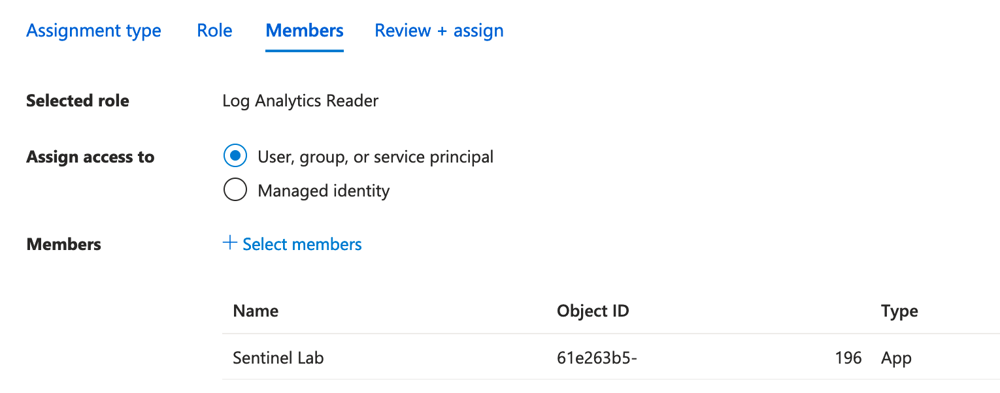

# Requirements
Sentinel App registration and sufficient permission settings have to be prepared prior to the use of this integration.

## Implementation

1. **Azure App Registration**  
It is recommended to create a new app registration for the purpose of the Mekanoid integration.

2. **Generate a client secret**  
In the registered app, generate a new client secret and save it together with application (client) ID and directory (tenant) ID for use during connection setup inside Mekanoid.

3. **Grant API permissions**  
Setup correct API permissions in the registered app.
Follow "APIs my organization uses" -> type "Log Analytics API" -> select "Application permissions" -> add "Data.Read"

Don't forget to grant admin consent to the newly added permissions.

## Permissions

### Basic Read
The minimum set of permissions to perform read operations in Sentinel from Mekanoid to be configured on the Log Analytics workspace.

1. **Navigate to your Log Analytics workspace**

2. **Access control (IAM)**

3. **Add role assignment**  
Add roles "Log Analytics Reader" and "Log Analytics Contributor" to the registered app.
Apps are not visible members by default and only appear when searched for.

### Write, Create and Delete
For manipulaitve tasks like creating an incident or delete a watchlist, add assigment for either role "Microsoft Sentinel Contributor" or "Microsoft Sentinel Responder" as described in 'Basic Read' step 3)
